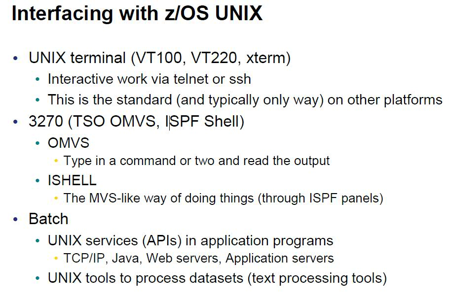

#Linux, Unix, USS, BackTrack5笔记
----------
##Linux常用命令
####[终端Terminal]
           Command+T: 打开一个新的标签 [iTerms2]
	   Ctrl+A/E 将光标置于最前/末
	   Ctrl+U/K 清除光标以前/后所有的字符
	   Ctrl+B/F 光标向前/后移动一个字符
	   Ctrl+H/D 光标处往前/后删除一个字符
	   CTRl+R   搜索历史命令
####[文件File]
	   df :显示磁盘空间使用情况
	   grep -r 'zh_CN' /etc： 递归查找/etc下面含有'zh_CN'字符串的文件
	   locate rails | grep bin :查找rails安装路径
	   find . -name 'my*' -ls  
	   find . -name "rake*" -ls  
	   du -smh foldername: 查看文件夹总的占用空间
	   du -h --max-depth=1: 查看当前文件夹下所有文件的大小
   	   cp -Rf A/* B/     :拷贝A目录下所有文件到B目录
   	   rename "s/.textile/.markdown/" *   #将当前目录下所有.textile的文件扩展名改为.markdown 
   	   env: 显示所有环境变量  将自定义环境变量添加至:/etc/profile 或者~/.bash_profile即可
####[解/压缩commpress]
	   7z e foo.7z  
	   tar -xjvf foo.tar.bz2  
	   tar -czvf target.tar.gz source_dir
           tar -xzvf target.tar.gz
####[系统System] 
	   echo $PATH   #查看PATH  
	   PATH="$PATH:/home/workdir"    #追加/home/workdir到PATH  
####[网络Network] 
           netstat –apn: 查看端口情况
	   wget ftp://180.178.38.221:21/web/wp-content/uploads/* --ftp-user=tree123 --ftp-password=B5EEAAE70102e6 -r  
	   #copy all files from remote ftp under /web/wp-content/uploads/ deretory  
	   
####[编辑器Vim]
     vim与系统剪切板('+')的通信:  
     sudo apt-get install vim-gui-common安装支持系统剪切板的vim。  
     :reg命令可以查看vim里的剪切板。这时你可以看到多了"+行，这是系统剪切板。  
     "+y命令复制到系统剪切板。"+p从系统剪切板粘贴  
     Shift+Ctrl+V: 解决"+p中文乱码问题  
     :%s/aaaa/bbbb/g 全文替换  
     :g/select/d :将文件中所有行有select关键字的行删掉  
     :1,$!sort -r -k 1 -t" " -n     从第一列开始起，按照第二个field排序，分隔符是' '， -n表示按照数值 排序，-r表示降序 这样的话，不会出现'23 '大于'123'的情况  
     :%s/[^\x00-\xff]/\r/g 将所有非ASCII0-255的字符都替换成换行符，可用于去除中文     
     :%s/\s\+//g 删除文中所有空格  
####[其他/Others]
#####VIM+Ruby实现对行长度排序
  第一步：用Ruby对每一行长度统计，将长度写在每一行行首
   	
   	arr=File.open("enword.txt","r").readlines
            fileout=File.new("enword1.txt",'w')
               for i in 1..lines-1 do
                newline = arr[i].chomp.rstrip.length.to_s + ' ' + arr[i]
            end
  第二步：用vim打开enword1.txt*        
`	:1,$!sort  -k 1 -t" " -n   #按照第一列的长度值排列 `   
  第三步：去掉前面的数值   
    `:%s/^[0-9 ]*/s*//g `

##USS(Unix System Service)常用命令
####USS基础知识
- 1994 年，MVS4.3（一个z/OS 老版本）提供了UNIX，从此可以用C或者Java编程
- 跟USS打交道的方法(如图)：  

- HFS： Hierarchical File System

####[常见命令]
	左键复制邮件粘贴  
	man wc  查看'wc'命令的用法
	cd/pwd/zip/unzip/tar/mv/rm/cp/mkdir/chmod/  
	unzip FileName.zip  zip FileName.zip DirName 
	ls *list ls ?ist  *匹配任意多字符 ？匹配一个字符 
	cat 显示文件 
	ps -ef|grep bfagent  显示所有bfagent进程
	head science.txt  显示前面10行 （head -5 science.txt）
	tail science.txt  显示最后10行
	grep -i 'spinning top' science.txt t  把science.txt里所有含有‘spinning top'的行都显示出来，忽略大小写
	find . -name "*.txt" -print 在当前目录开始查找所有的txt文件
	find . -size +1M -ls 
	grep -ivc science science.txt 
		-v display those lines that do NOT match
		-n precede each matching line with the line number
		-c print only the total count of matched lines 	
	wc -w science.txt  统计词数 wc -l science.txt  统计行数
	who 查看系统上有谁在线 who | wc -l 查看系统上有多少人在线
	diff file1 file2 ：比较2个文件		
 	echo $HOME $PATH显示变量  
	env 显示所有环境变量
####[常用路径]
	~/bin: for me, customized cmd/tool path.      
	/etc/profile: for all users
	$HOME/profile: for me
	ls -alt 列出当前文件夹下所有文件，包含group信息，并且以时间排序
	find /u/  -name  xxx  查找文件(夹)
	history 显示命令历史  history 25
	history | grep -i 'name' 只列出'name'字符串的命令历史  
####[常见权限]
	cd usr/lpp/jazz/v3.0/buildsystem/buildtoolkit
	chmod 755 libRTCzMVSExec.so
	chmod 755 libRTCzMetadata.so
####[解/压缩]
	pax -rf RTCz-BuildForgeAgent-I20100111-0110.tar
####[添加文件扩展名(extended file attributes)]
	extattr +p -s bfagent
	ls -E 显示（extended file attributes）
	-rwxr-xr-x -p-- 1 IBMUSER SYS1 4915200 Jun 29 09:10 bfagent
####[Putty快捷键]
	后退删除： Ctrl+H 不是Backspace
####[USS里显示之前的command]
	vi ~.profile
 	添加： set -o vi
	重启USS
	按Esc + k 键来显示之前输入的command.
####[USS里自动补全]
 	按ESC + |键
	
##BackTrack5常用命令
####[安装win7&BT5R1 双系统]
   [http://www.kylins.org/163.html](http://www.kylins.org/163.html)     
   
###windows7+backtrack双系统安装  
   准备安装在E盘，清空E盘。E盘空间有63G。选择创建逻辑分区/dev/sda5 /dev/sda6 /dev/sda7 分别挂载/ (40G) /boot (2G) /home (10G) swap （5G)
    修复启动显示小故障 root/toor之后运行:fix-splash

####[BT5R1安装NVIDIA显卡驱动]
```   
   BackTrack5自带的显卡驱动是第三方的Nouveau驱动,效果非常地不好 浏览网页等操作时出现卡顿的情况 因此需要更新一下驱动 升级为NVIDIA官方驱动
   安全模式启动BT5R1,登录root/toor, 先不要运行startx
   到NVIDIA官网找到自己的显卡驱动，下载到~/
   wget http://us.download.nvidia.com/XFree86/Linux-x86/295.59/NVIDIA-Linux-x86-295.59.run  （G 105M对应的显卡驱动,已安装成功)
   cp /etc/X11/xorg.conf  /etc/X11/xorg.conf.backup       #备份现有配置文件
   sudo gedit /etc/modprobe.d/blacklist.conf      #添加黑名单防止其他驱动干扰nvidia
      	blacklist vga16f
   		blacklist nouveau 
		blacklist rivafb
		blacklist nvidiafb
		blacklist rivatv
   运行: sh ./NVIDIA-Linux-x86-295.59.run  按照提示安装即可
   sudo gedit/etc/X11/xorg.conf  在Section "Device"中添加:
   Option "NoLogo" "True"    #去掉logo显示 
   屏幕默认是2X3屏幕，在Section "Screen"中添加下面这句:
   Option         "ModeValidation" "NoTotalSizeCheck"  
```
####[更新最快的源]
  ```
  System -- Administration --Software Source -- Ubuntu Software -- check all 5 items unber 'Download from Internet' --Select best server 
   sudo cp /etc/apt/sources.list /etc/apt/sources.list_backup 
   vim /etc/apt/sources.list
   deb http://ubuntu.srt.cn/ubuntu/ lucid main  universe restricted multiverse              #add this line at the bottom
   sudo apt-get update   
   sudo aptitude update                  # update without any warnnng&error
   apt-get update --fix-missing
   apt-cache search 正则搜索package
   apt-get upgrade
```

####[安装中文环境，ibus,scim 中文输入法，添加开机启动]
   ```
   root@bt:~#apt-get install language-support-zh language-pack-zh
   root@bt:~#apt-get install language-pack-gnome-zh language-pack-gnome-zh-base language-pack-zh language-pack-zh-base language-selector
   root@bt:~#apt-get install scim
   root@bt:~#sudo apt-get install ibus
   System:IBUS Preferences:Startup Applications:Add,Name: ibus daemon,Command: /usr/bin/ibus-daemon -d
   重启系统，按cntl+space就能看见中文输入法
```

####[安装adobe reader. BT5自带的xpdf太丑了]
   ```
   root@bt:~# cd /tmp
   root@bt:/tmp# wget -c http://221.1.222.15:82/down/AdbeRdr9.4.2-1_i486linux_enu.tar.bz2
   root@bt:/tmp# tar jxvf AdbeRdr9.4.2-1_i486linux_enu.tar.bz2
   root@bt:/tmp# cd AdobeReader
   root@bt:/tmp/AdobeReader# ./INSTALL  	
   安装到了默认目录： /opt/Adobe
```
####[任务栏默认不显示已打开程序]
   解决：点击"Add to Panel",把'window selector' 添加到任务栏

#### [安装配置vim]
   系统自带vim7.2 用whereis vim查到路径: /usr/share/vim/  
   拷贝自用的vimrc到~/.vimrc,安装必备的插件至/usr/share/vim/vim72/ 比如nerdtree,taglist等  
   :helptags /usr/share/vim/vim72/doc/  
   apt-get install ctags         #instgall ctags to /usr/bin/  

####[Vim NerdTree 目录显示乱码('?')]
   **解决**：`vim /usr/share/vim/vim72/plugin/NERD_tree.vim  ` 
   将`call s:initVariable("g:NERDTreeDirArrows", !s:running_windows) `的!去掉

#### [设置系统声音]
  
  root登录声音很小，且声音设置无法配置。一直显示：
   > waiting for sound system to respond
   
   http://hi.baidu.com/goking58/item/7e7c22f7100c6e11d89e72cc
   解决办法:**将root加到pulse-access组**
   
   `sudo usermod -a -G pulse-access root`  
   
系统是不提供root用户声音响应的，点击声音滑块栏会出现等待声音系统响应字样，这是由于声音是由pulseaudio控制的，默认情况下root没有访问pulseaudio的权限
 ```
   System -- Preference -- Start up
   Name: Pulseaudio daemon
   Command:/usr/bin/pulseaudio
   Comment: Start the sound daemon
   logout then login again
   ```
#### [安装chrome,并且设置允许root身份运行]
    sudo dpkg -i google-chrome-stable_current_i386.deb 
    hexedit /opt/google/chrome/chrome TAB键切换到右侧ASCII码模式，按Ctrl+S搜索功能，查找geteuid，当光标停到首字母的地方后，直接输入getppid就能修改，Ctrl+X保存退出.

#### [安装配置rhythmbox收听cnn,cbs,fox,nbc]
    apt-get install rhythmbox
    last.fm帐号: LastDance4U supertree1987@163.com 456 
    插件默认安装位置:/usr/lib/rhythmbox/plugins/
    如果遇到mms,rtsp协议不能播放,记得安装GStreamer相关，ubuntu-restricted-extras，这样你就能突破ubuntu的默认限制，播放更多格式/协议 

####[安装Hinedo收音机]
    事先要安装libgtk2和mplayer.
    apt-get install libgtk2.0-dev 
    修正"正在更新"错误: 请将最后一行 os.execl(dir_path+'update_menu')修改成os.execl(dir_path + 'update_menu' , '')

####[安装openoffice套件]
    下载官网的:Apache_OpenOffice_incubating_3.4.0_Linux_x86_install-deb_en-US.tar.gz
    tar zxvf 解压                 #install all .deb packages
    cd desktop-integration/       #installl desktop integration 
    dpkg -i openoffice.org3.4-debian-menus_3.4-9590_all.deb 
  
####[安装星际词典stardict]
    apt-get install stardict
    去csdn上下载一些网友典藏的词典，解压放置到:/usr/share/stardict/dic/ 重启stardict即可   

####[安装ruby版本控制工具rvm]
    https://github.com/wayneeseguin/rvm
    curl -L get.rvm.io | bash -s stable --ruby --rails                  #顺便安装最新版的ruby和rails
    rvm reload
    rvm indo

####[让终端启动即最大化(Alt+F10)]
    /usr/share/applications/gnome-terminal.desktop  
    方法一：vim ~/.bashrc  add:
    alias gnome-terminal='gnome-terminal --maximize'
    方法二: System -- Preference -- Keyboard Shortcut
    映射gnome-terminal --maximize 为快捷键F1
 

           
