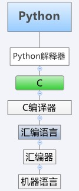

##Python学习笔记##
####Python常识
- Python诞生1989年圣诞，由龟叔因无聊发明  
- 龟叔给Python的定义：**优雅，明确，简单**  
- Python的解释器：最常用CPython，用C语言编写，其他的还有JPython, IPython,Pypy等.    

- Python最具特色的是用**冒号和缩进**来标明成块的代码,Python这样设计的理由纯粹是为了程序好看。

####一些教程
[电子书](http://www.iteye.com/topic/1127617)  
[廖雪峰的官方网站](http://www.liaoxuefeng.com/wiki/001374738125095c955c1e6d8bb493182103fac9270762a000)  
[Vamei](http://www.cnblogs.com/vamei/tag/Python/)  
[Dive into Python中文版](http://woodpecker.org.cn/diveintopython/index.html)  
[微信开发](http://www.cnblogs.com/txw1958)  
[爬虫](http://www.hopez.org/blog/9)
[爬虫](http://segmentfault.com/blog/javachen/1190000000583419)
####在用Python的大公司
	Google,Youtube,Yahoo,NASA, Dropbox,Douban
####Python能做什么不能做什么?
- 能做：脚本任务,自动备份MP3，做网站(Youtube)，	在线网络游戏后台，中文分词，邮箱采集+群发邮件+gui+数据库
- 不能做：写操作系统(C),写手机应用(Obj-C&Java),写3D游戏(C&C++)

####爬虫Spider教程
	http://blog.csdn.net/column/details/why-bug.html
	使用python编写简单网络爬虫技巧总结
	http://armsword.com/2014/03/31/python-in-crawler.html
- 爬虫的速度优化	
	
	减少不必要的命令使用，这样能减少磁盘的IO消耗和CPU的效能计算
	多线程功能，来提高脚本整体的并发性
- 爬虫后期的扩展性  
	变量	
		
####一些知识
	python号称betteries inclued,自带电池的意思，是说它自带的标准库足以满足大部分工作
	要是嫌easy_install慢，可以用豆瓣的源：easy_install -i http://pypi.douban.com/simple/ xxx 或者其他的源：http://www.pypi-mirrors.org/
	Python模块放在什么地方：import sys -> print sys.path
	第三方包路径： /Library/Python/2.7/site-packages/
	进入命令行模式>>> python  退出交互模式exit()
	在程序的头一行添加 #!/usr/bin/env python 可以将程序作为可执行命令直接运行 ./hello.py
	多行字符串： 用'''
	行末用\表示续行
	一个常用的注释技术是：用三重引号来建立多行注释，特别是__doc__里
	raw_input()
	函数不确定参数个数：def foo(*args) 或者def foo(**args)
	为了避免歧义,比如(1)，Python 规定，单元素 tuple 要多加一个逗号“,”
	Python标准库中的正则表达是参考Perl，而lambda, map, filter, reduce等函数参考了
	Lisp
	pyc文件是在运行时进行优化使程序运行更快，它不能替代py文件
	Python提供了100个左右内置函数BIF，可以用dir(__builtins__) 查看
	初始化一个二维数组List的方法：
	array=[0 for i in range(10) for j in range(10)]
	Class里的方法的第一个参数必须是self，无论是否用到
	Class中定义了__init__()这个方法，创建对象实例时，Python会自动调用这个方法。这个过程也叫初始化
	将功能相似的模块放在同一个文件夹（比如说this_dir）中，构成一个模块包，通过import this_dir.module引入文件夹this_dir下所有的模块。该文件夹中必须包含一个__init__.py的文件，提醒Python，该文件夹为一个模块包。__init__.py可以是一个空文件。
	添加自己的模块：sys.path.append('/Users/michael/my_py_scripts')
	Python提供了__future__模块，把下一个新版本的特性导入到当前版本
	
####List（列表)和Tuple(元组)和Dict(字典)
两者都是Python内置的有序集合
- **List**  可变  
    1.方括号，有方法(append,remove,pop,index,insert,len,)  
    2.在内存中存储为自下而上结构的堆栈，最先的元素存在最下面
   	   movies=['movie1','movie2','movie3']    movie1存在最下面  
   3.遍历用for a in movies: print a 或者While count < len(movies): print movies[count]  
   4.用内嵌函数isinstance(movies,list)判断movies是不是list
- **Tuple**	 不可变   
    1.圆括号 ，没有方法(但是有in方法 "z" in t 返回True)
- **Tuple相比List的好处**  
   1. 速度快，常用定义经常遍历的常量集
   2. 写保护，更安全
   3. 因为不可变，Tuples 可以在 dictionary 中被用做 key，但是 list 不行  
   4. Tuble和List可以互相转换    
- **Dict** 可变
   1. 大括号{}，有keys,values,items,clear四个函数
   2. 10个元素和10000个元素查找速度一样快，List则随元素增加而查找变慢
   3.  简单地使用 d[key] 的形式来查找对应的 value
   4. 无序存储，无序打印. Key唯一，Key不可变
   5. 用 for key in d遍历Dict
- **Set** 
   1. 无序，不重复，自动去重
   2. 用一个in方法用来判断元素是否存在于Set中，可以用for name in s来遍历
   3. 例子：weekdays = set(['MON', 'TUE', 'WED', 'THU', 'FRI', 'SAT', 'SUN']) 避免用if繁琐
   4. 提供S.add()和S.remove方法

####函数
http://docs.python.org/2/library/functions.html#abs  
或者 help(abs)
###Python函数式编程  
[Python函数式编程指南](https://www.evernote.com/shard/s133/sh/716693f3-e0d8-4aa1-91a0-451cde5bf558/3c4c951c035b1738236be882b527d64c)
lambda, map, filter, reduce函数

####标准库
https://docs.python.org/2/library/  (经常访问，查看标准库的用法)    
  

	 import random
	 help(random)  显示任意库的信息：引用位置，用法等
	 dir(random) 显示random模块所有提供的方法
	 help(random.randrange) 显示特定方法的用法
- 覆盖了网络、文件、GUI、数据库、文本等大量内容，被形象地称作“内置电池（batteries included）”。用Python开发，许多功能不必从零编写，直接使用现成的即可。
- 当mymodule.py被**第一次**导入的时候，python首先要对其进行编译字节码，生成扩展名为.pyc的同名文件，然后才执行mymodule模块的代码，创建相应的对象等 。.pyc文件中有一个时间戳，python会自动检查这个时间戳，如果它比同名的.py文件时间戳旧，就会重新编译。 
- Python搜索模块的顺序  
   程序当前主目录->PYTHONPATH目录(环境变量)->标准库目录->任何.pth文件的内容

####扩展库(第三方库)	
####正则re
14个转义：+ . * () [] {} \ |? ^ $ 自编助记歌："加点心，三括号；斜竖杆，问尖刀"
####Django  
	sudo easy_install django
	import django
	print(django.VERSION)
	django-admin.py startproject mysite #创建服务器网站
	python manage.py runserver 8000 #启动服务器网站