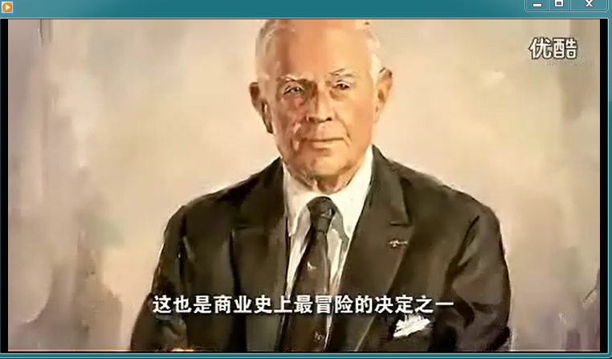
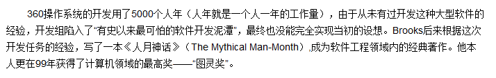
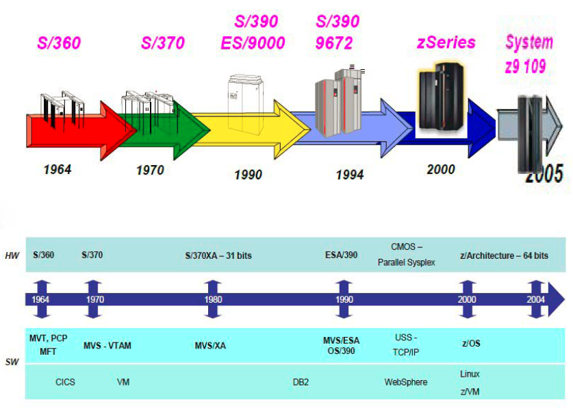
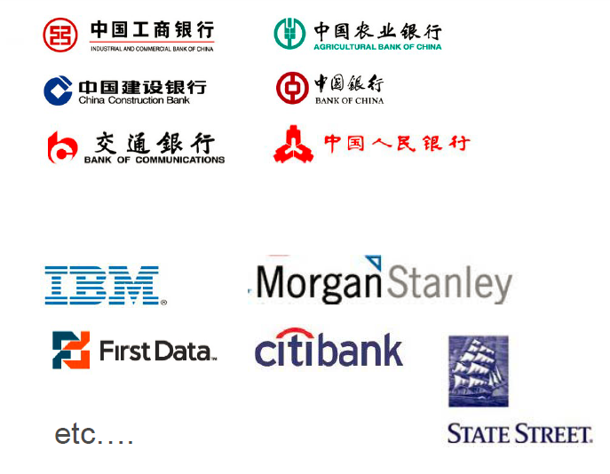
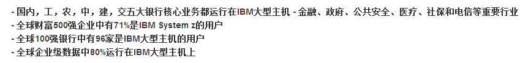
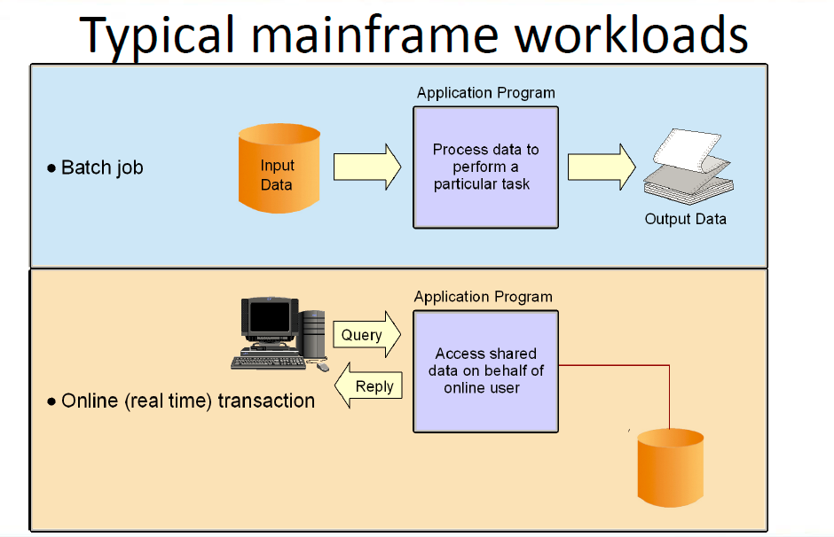
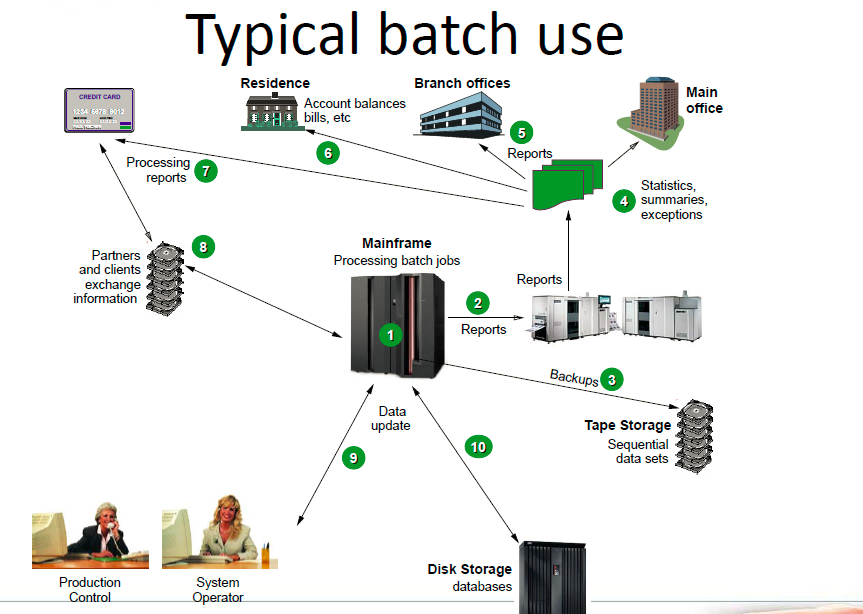

#z Experience Sharing （2013.7.26）
#### 2010.3~2013.5 就职于道富银行(State Street) z开发		
****
##什么是Z？  
**mvs，os/390，z/os，绿屏，大型机，大机，主机，Mainframe**   
TRY Google: `IBM财报` and then `IBM财报 system z` ， 自己对比一下两次搜索结果   
Conclusion：**IBM的摇钱树**

##z/OS的发展  
IBM百年庆宣传片 OS/360(1964.4.7) 
      
   
         
s/360->s/370(MVS)->s/390->z/OS(主流)  
最新：zEC12(TB级别) z/OS V2.1  

##谁在用Z？  
       
     

----------

##z程序员的工作方式  
-  **模拟终端**: PCOM，TN3270X，TN3270 Plus， Aviva etc..   
-  User->TSO->z/OS（不友好） ==>  User->ISPF->TSO->z/OS       

##编程语言/数据库   
- 应用编程：Assembler,PL/I,COBOL   
- 系统编程 TSO Command,REXX，CLIST   
- 数据库： DB2,IMS 
 

##z上面的程序怎么运行（BATCH和ONLINE） 
  

1. **BATCH**（极少人工干预）   
JES（JES2/JES3） Z/OS 操作系统通过JES子系统对系统中绝大多数的作业进行控制和管理，包括从系统外部接收作业、对系统中的作业进行调度、管理作业的输出等。 
JCL：用户与操作系统的借口 SDSF Job（进程）
DEMO：MYUID.PROJ.JCL  
  
1. **ONLINE** （人机交互）    
ATM机  
CICS中间件

##权限管理/安全管理   
RACF：（资源访问控制程序）  收费的
RACF识别并授权给一个用户，并决定这个用户可以使用什么样的资源，并且对非授权用户试图访问保护资源进行记录日志和报告    
   
ISPF, type `6,RACF` 

##版本控制     
- **产品**：Changeman, Endevor 
- **3-Level**: Dev/Test/Prod     
- **概念**：Promote/Demote, Loadmodule  
 

##z自动化   
- **用户角度**：模拟用户操作，解放双手 宏录制 Vb/Vba  例子：MYUID.PROJ.JCL auto_demo    
- **开发者角度**：脚本 rexx 批量重复化的工作(查找,I/O操作，monitor) 例子：MYUID.REXX.EXEC  
- **系统部署维护角度**：  
	WSIM ?